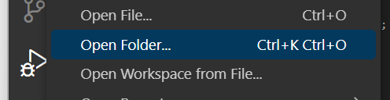
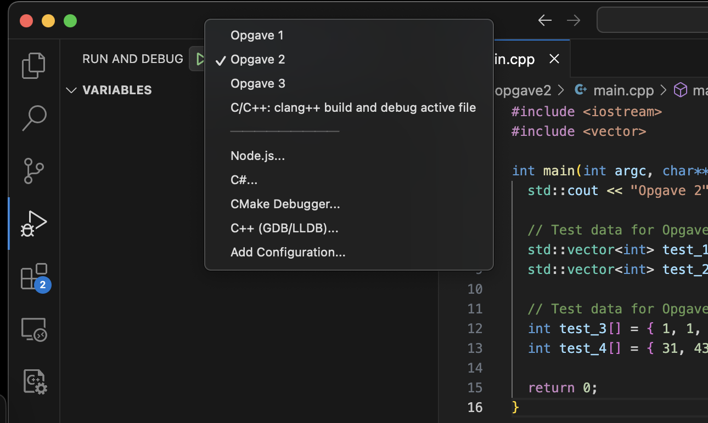

Der er udleveret projektfiler og kildekode til Visual Studio Code i et ZIP-arkiv (`sw1oprg-01-exam-e2024-handout.zip`).

I den udpakkede mappe ligger følgende filer og mapper:

```
sw1oprg-01-exam-handout
  .vscode/
    launch.json
    tasks.json
  bin/
  src/
    opgave1/
      main.cpp
    opgave2/
      main.cpp
    opgave3/
      dato.cpp
      dato.h
      main.cpp
```

Udpak ZIP filen og åbn mappen `sw1oprg-01-exam-handout` i Visual Studio Code:


### Sådan kompilerer og eksekverer du koden
Opgaver kan bygges og køres på to forskellige måder: med terminalen eller med VSCode. Det står dig frit for hvilken metode du benytter, og du må gerne bruge din egen metode, hvis du hellere vil det.

#### Terminal
Du kan bruge terminalen til at kompilerer koden. Hver af de følgende kommandoer bygger alle .cpp-filer placeret i *mappen for opgaven*.
##### Kompilering
```
# Opgave 1
g++ -g -std=c++11 src/opgave1/*.cpp -o bin/opgave1

# Opgave 2
g++ -g -std=c++11 src/opgave2/*.cpp -o bin/opgave2

# Opgave 3
g++ -g -std=c++11 src/opgave3/*.cpp -o bin/opgave3
```

##### Eksekvering
```
# Opgave 1
./bin/opgave1

# Opgave 2
./bin/opgave2

# Opgave 3
./bin/opgave3
```

Alle ovenstående kommandoer antager, at din terminal befinder sig i din workspace mappe (roden af den udleverede mappestruktur). De virker både på macOS og Windows.

#### Visual Studio Code
Vælg "Run and Debug" ude i venstre side (eller brug shortcut Ctrl+Shift+D på Windows eller Cmd+Shift+D på macOS) for åbne vinduet.

Vælg herefter hvilken opgave, som du vil teste i dropdown-menuen øverst til venstre (se billedet ovenfor) og tryk på "Start Debugging" (eller shortcut F5 på Windows og macOS).

Ovenstående både bygger og starter programmet, hvis kompileringen var succesfuld.

### Aflevering
Kildekoden (.cpp-filer og .h-filer) til din løsning afleveres i ZIP format. Dette gøres ved at komprimere (zip'pe) din `src/` mappe.

Tjek en ekstra gang om formatet er ZIP, hvis du har installeret 7-Zip, WinRAR eller andre kompressionsværktøjer på din maskine.